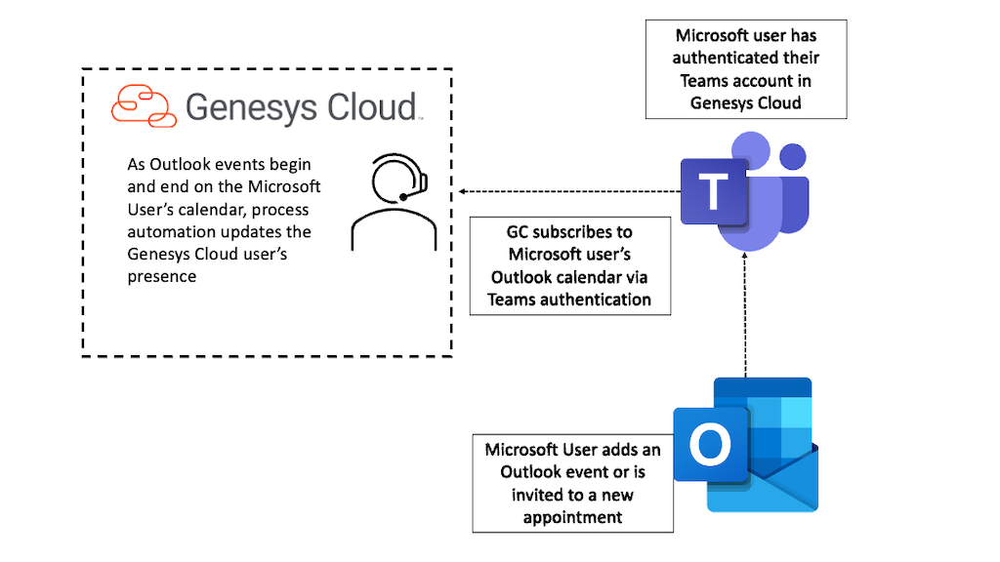

# Setup a Genesys Cloud Associate User

This Genesys Cloud Developer Blueprint describes how to set up Genesys Cloud to update a Genesys Cloud user's presence when Outlook Calendar events begin and end.

This GitHub repo contains the files required to configure this blueprint.  Full instructions can be found in the [Genesys Cloud Developer Center](https://developer.genesys.cloud/blueprints/).

